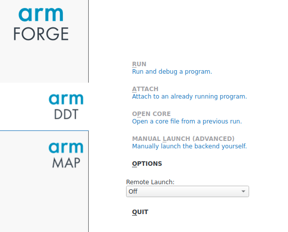
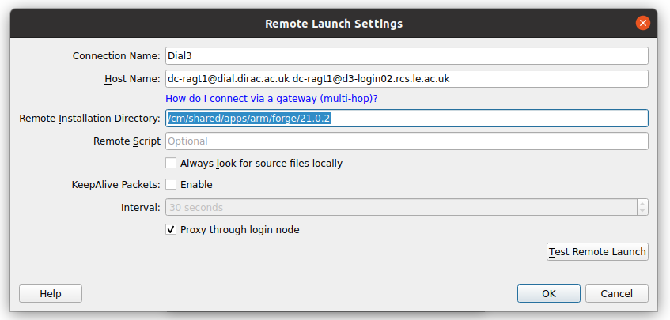

# Install Arm forge on your PC

You can install Arm forge on your local system and use the locally installed Arm forge to view your code profile. This method will be faster that X forwarding (as mentioned in [What is Arm Forge](./about_arm_forge.md)). 

Arm forge describes this way of working as “Reverse connect” in which we generate the profiles offline (by usual job submission scripts) and instead of using -X flag to use a GUI, we install the software on our local system. Once we have the software on our local system, we connect it with the one present on the server (DIaL3 in this case).

Please follow the steps below to install Arm forge and connect it with the server.

**(A).** First download the Arm forge from the official website (https://developer.arm.com/tools-and-software/server-and-hpc/downloads/arm-forge)

**(B).** Install the arm forge in your desired location. For Linux, the downloaded files contain a file called ‘installer’. Double clicking on it will install the software in your desired location.

**(C).** Change to the directory where you installed the software. For example, I installed it in /home/my_preferred_location/arm/forge/21.0.3.

```bash
$ cd /home/my_preferred_location/arm/forge/21.0.3.
```

**(D).**. Change directory to the bin directory.

```bash
$ cd /home/my_preferred_location/arm/forge/21.0.3.
```

**(E).**. Launch the arm forge software.

```bash
$ ./forge
```

**(F).** Go to the remote launch option in the main GUI and click configure.



**(G).** After clicking configure, you will be presented to add a new connection. Click on add and fill in the following values (Please adjust accordingly).

- **Connection Name:** Fill in any name you want (e.g. Dial3)
- **Host name:-** Enter the host name to which you want to connect to. Arm forge expects these values to be a space separated list. (For dial, you will only need to enter the first value i.e. ignore the value after space). Eg. :- [dc-ragt1@dial.dirac.ac.uk](mailto:dc-ragt1@dial.dirac.ac.uk)  [dc-ragt1@d3-login02.rcs.le.ac.uk](mailto:dc-ragt1@d3-login02.rcs.le.ac.uk)
- **Remote Installation Directory:-** /cm/shared/apps/arm/forge/21.0.2 (Please do not change this).



**(H).** Click Ok, then close. Now you will see an entry with the Connection name (here Dial3) in the main GUI under remote launch. Please click on this name and you will be prompted to enter your password twice. First to connect with Dial2.5 and then to Dial3.

*Please note that this is a one time setup and you do not need to do it again. You will only need to connect with the server anytime you want to use the Arm forge.*