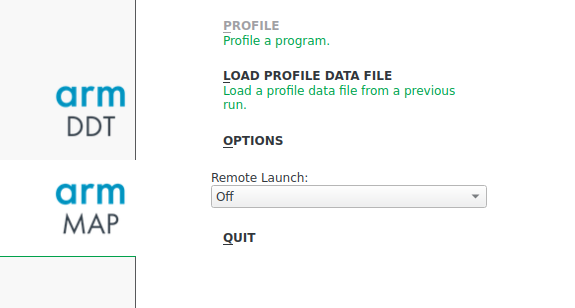

# Profile your code using Arm MAP 

Arm MAP is a Arm Forge's scalable profiler that can be used to profile serial and parallel applications. It allows you to profile your code without distorting application behaviour. It can be used to profile C, C++, Cuda, Fortran and Python code with no instrumentation or code changes. It helps the developers to accelerate their code by revealing the bottlenecks in their code such as the function taking maximum time, excessive time spent in  MPI communication, slow I/O etc. 

In order to profile your code, please follow the stpes given below.

**1.** Recompile your code by including the debug flag i.e. `-g`. This will allow the Arm MAP to gather the necessary information during runtime.

**2.** You can use the following script to the scheduler which will automatically generate your code profile.

```bash
#!/bin/bash --login

#SBATCH -J Your_Job_Name
#SBATCH -o Your_Object_File_Name.o%j
#SBATCH -e Your_Error_File_Name.e%j
#SBATCH -p Partition_on_which_to_run_code
##SBATCH -A Account
#SBATCH --nodes=8
#SBATCH --ntasks=16
#SBATCH --ntasks-per-node=2
#SBATCH --exclusive
#SBATCH -t HH:MM:SS

export nodecnt=$SLURM_JOB_NUM_NODES
export corecnt=`expr ${SLURM_CPUS_ON_NODE} \* ${nodecnt}`
export mpicnt=$SLURM_NTASKS
export threadspermpi=`expr ${SLURM_CPUS_ON_NODE} \/ ${SLURM_NTASKS_PER_NODE}`
export threadcnt=`expr ${mpicnt} \* ${threadspermpi}`
export OMP_NUM_THREADS=$threadspermpi
export OMP_PLACES=cores

if [ $threadcnt -ne $corecnt ]
then
  echo "Error, mismatch between requested and available hardware!"
  exit -1
fi

#Dial3
module purge
module load intel-parallel-studio/cluster.2019.5
module load arm/forge/21.0.2

#This will prevent Arm forge from closing if it cannot find license within a specified limit. 
export ALLINEA_NO_TIMEOUT=1

export EXE_DIR=Your_executable_directory_path

#The following command is responsible for generating your code profile.
map --profile  --processes=$SLURM_NTASKS --procs-per-node $SLURM_NTASKS_PER_NODE --mpi=intel-mpi $EXE_DIR/Your_executable
```

**3.** Once your job ends, you will see a file with an extension `.map` which is your code profile. This file would be placed in the same directory from which the job was launched.

**4.** Now connect the arm forge form your local system to the server and click on Arm map in the main GUI as shown in the image below.



**5.** Click the option <span style="color:green">'load the profile data from a previous run’.</span> Browse to the location of file generated in <u>*Step3*</u>.

**6.** This will now open the map profile and will give all necessary details about your code such as: OpenMp stacks, function times, MPI times, overhead etc. We can navigate through the source code also to see which function is taking more time. A typical code profile would like the image shown below.


