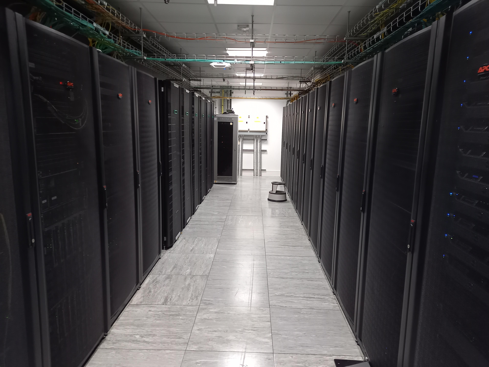

# DIaL3

The University of Leicester hosts one of the four High Performance Computing (HPC) systems that forms the part of Distributed Research Utilising Advanced Computing (DiRAC). The other three sites are: Cambridge, Durham and Edinburgh.

The DiRAC HPC resources are classified into 4 categories namely:-

1. Data Intensive at Leicester (DIaL)
2. Data Intensive at Cambridge
3. Memory Intensive at Durham 
4. Extreme Scaling at Edinburgh

For more information about DiRAC service, please see the link: [https://dirac.ac.uk/](https://dirac.ac.uk/) .

Data Intensive at Leicester (DIaL) is a term collectively used for two HPC systems at UoL: DiAL2.5 and DiAL3. For more information about DiAL2.5, please follow [Dial2.5](https://www2.le.ac.uk/offices/itservices/ithelp/services/hpc/dirac) (You will have to login using your UoL username and password).

DiAL3 is a new HPC facility that has been recently purchased under the grant of 2 million pounds provided by Science and Technology Facilities Council (STFC). The system will be available for production usage from September 30, 2021. The following image shows the DiAL3 HPC facility at UoL.

For more information about DiAL3 and its architecture, please visit the following links.

1. [Architecture](./About_dial3/architecture.md)
2. [FileSystem](./About_dial3/architecture.md)
